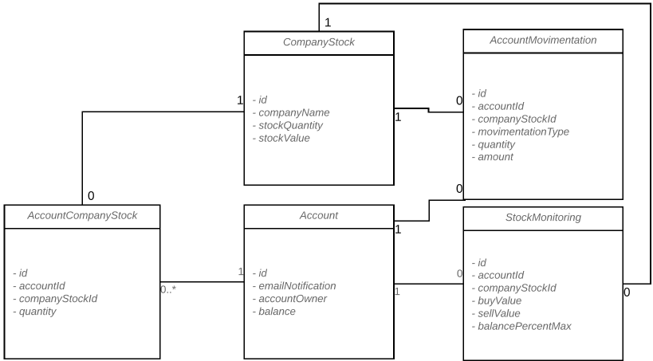

Sistema de Compra e Venda automática de Ações

**1. Objetivo**

​	Este sistema tem por objetivo realizar a compra e vendas de ações automaticamente de acordo com os monitoramentos que um usuário solicitar.

**2. Arquitetura**

​	Para este projeto foi utilizado a linguagem de Programação JAVA com os seguintes frameworks e bibliotecas:

- Spring Framework – Injeção de dependências, comunicação com o Banco de dados e envio de e-mail
- Axis – Comunicação com WebService externos ao sistema
- SLF4J – Logs do sistema
- Jersey – Disponibilização de serviços REST’s
- jUnit – Testes Unitários

O projeto foi dividido em três módulos: domains, api e api-client.

Módulo “domains” contém os objetos que referenciam entidades que possam ser sincronizados com banco de dados ou transportadas entre projetos

Módulo “api” responsável por fazer a interação com o Banco de dados, regras de negócio, disponibilizar serviços web (REST), rotinas agendadas, carga inicial e chamada a webservice externo. 

Módulo "api-client" responsável por fazer os testes no módulo API, desde que esteja em execução.

O módulo API foi divido nas seguintes camadas:

- DAO – Classes responsáveis por integração com o banco de dados
- Exceptions – Possui as exceções de negócio
- Jobs – Contém as tarefas agendadas do sistema
- Mocks – Realizar uma carga inicial no sistema
- Rest – Classes que disponibilizam WebService Rests
- Service – Possuem as regras de negócio do sistema.
- WebService – Classes de comunicação com WebServices Externos.

**3. Serviços Disponibilizados:**

​	Abaixo estarão os caminhos disponibilizados com suas devidas descrições, todas as urls terão o prefixo “**nomeDoServidor:porta/actions-api/rest/**”:

| /accountmovimentation/byAccountId/{accountId}  Método: 		GET | Retorna as movimentações de conta de acordo com o identificador da conta passado por parâmetro |
| ------------------------------------------------------------ | ------------------------------------------------------------ |
| /accountmovimentation/byCompanyStockId/{companyStockId}  Método: 		GET | Retorna as movimentações de conta de acordo 		com o identificador da ação da empresa passado por parâmetro |
| /accountmovimentation/toEmailByAccountId/{accountId} 		Método: GET | Busca as movimentações da conta passada por 		parâmetro, envia por e-mail e retorna o conteúdo do e-mail. |
| /accounts/withdraw?account&amount&currency  Método: 		GET | Realiza o saque de uma conta                                 |
| /accounts/deposit?account&amount&currency  Método: 		GET | Realiza o depósito à uma conta                               |
| /accounts/{id}  Método: UPDATE                               | Atualiza os dados de uma conta                               |
| /accounts/{id}  Método: GET                                  | Retorna os dados de uma conta específica                     |
| /accounts/ 		Método: GET                               | Retorna todas as contas do sistema                           |
| /accounts/findAllActive  Método: GET                         | Retorna todas as contas ativas do sistema                    |
| /accounts/ 		Método: POST                              | Insere uma conta no sistema                                  |
| /companystock/{id}  Método: UPDATE                           | Atualiza os dados de uma empresa                             |
| /companystock/{id}  Método: GET                              | Retorna os dados de uma empresa específica                   |
| /companystock/ 		Método: GET                           | Retorna todas as empresas do sistema                         |
| /companystock/ 		Método: POST                          | Insere uma empresa no sistema                                |
| /companystock/{id}  Método: DELETE                           | Deleta uma empresa do sistema                                |
| /stockmonitoring/{id}  Método: UPDATE                        | Atualiza os dados de um monitoramento                        |
| /stockmonitoring/{id}  Método: GET                           | Retorna os dados de um monitoramento específico              |
| /stockmonitoring/ 		Método: GET                        | Retorna todas os monitoramentos do sistema                   |
| /stockmonitoring/ 		Método: POST                       | Insere um monitoramento no sistema                           |
| /stockmonitoring/{id}  Método: DELETE                        | Deleta um monitoramento do sistema                           |

**4. Entidades Criadas:**

**Account** – Conta de um usuário

**CompanyStock** – Ação de uma empresa

**StockMonitoring** – Monitoramento de ações por conta

**AccountMovimentation** – Histórico de Movimentação da Conta

**AccountCompanyStock** – Ações que uma conta possui.

**5. Rotinas / Jobs do sistema:**

O Sistema possui duas rotinas/jobs conforme descrito abaixo:

1. StockValueVariationJob – Rotina que faz a variação de 10% do preço das ações.
2. AutoNegotiationJob – Rotina que realiza a compra e venda de ações conforme os monitoramentos de ações cadastrados

**6. Observações Gerais:**

- Para ficar mais próximo a um sistema real, a variação de preço foi feito no preço das ações e não no valor de intenção de compra e venda conforme descrito no Desafio
- Todas as transações são feitas em **Dólar** e o saldo da conta também é em **Dólar**, devido a isso, no momento da realização de saques e depósitos em **Reais** os valores serão convertidos para **Dólar**, buscando a cotação do WebService disponível pelo Banco Central.
- Devido ser apenas um desafio, tempo curto e para facilitar a disponibilização do projeto, não está contido a utilização de um banco de dados, todas as transações são feitas em memória, porém está separado uma camada específica (**DAO**) para comunicação com banco de dados, caso exista a necessidade de uma conversão para utilização de banco de dados, seria apenas necessário alterar estas classes.
- Devido a eu não querer utilizar um e-mail próprio, fiz a implementação de envio de e-mail, porém está comentado a ação do envio, caso vire um projeto real, será necessário alterar o arquivo de configuração de servidor de e-mail.
- Este desafio foi projetado para rodar um servidor de aplicação Standalone, caso exista a necessidade de virar um projeto real que rode em ambiente cluster, os agendamentos de rotinas/jobs deverão ser substituídos para utilizar uma biblioteca especializada em jobs em cluster, como o Quartz.

**7. Executando o projeto**

Baixe o projeto.

Abra o shell ou prompt de comando (espera-se que se tenha o maven instalado e devidamente configurado)

Digite o comando mvn clean package -Dmaven.skip.test=true

Rodando no docker…

(espera-se que se tenha o docker instalado e devidamente configurado)

Após o término da compilação digite docker run --name tomcat7 -p 8080:8080 -d -v ***caminhoCompletoDeOndeEstaProjetoRaiz***/actions-api/target/actions-api.war:/usr/local/tomcat/webapps/actions-api.war tomcat:7-jdk8

Para rodar em um tomcat, acesse a pasta actions-api/target copie o arquivo actions-api.war para a pasta webapp do tomcat.

**8. Dados Iniciais**

Para facilitar nos teste, foram criados alguns dados iniciais em Account, CompanyStock e StockMonitoring no pacote mock dentro do projeto actions-api.

**9. Testes Unitários**

Feito somente para a entidade de Account, poderia ter feito para o restante seguindo o mesmo padrão, mas devido ao tempo, parei por aí :D

**10. Melhorias no sistema**

Poderá haver melhorias no sistema, como acrescentar arquivo de properties para externalizar as configurações, dividir o modulo actions-api em mais partes, separando banco de dados com regras de negócio, utilização de um banco de dados, acrescentar segurança de acesso às URL’s, entre outras